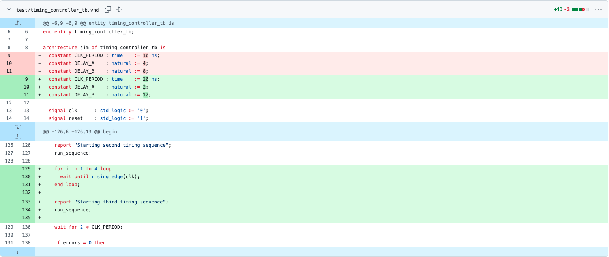
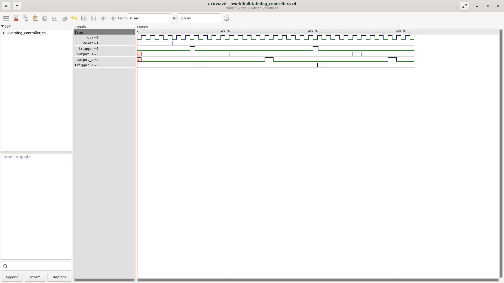
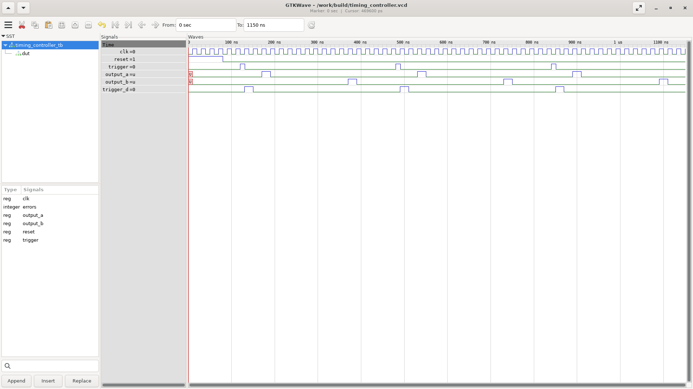

# Learnings from vhdl-timing-demonstrator

Hands-on notes on clock-driven timing in VHDL: delays are counted in
**clock cycles**, while the waveform axis is **wall-clock time** (ns).

## Source Code

| File | Role |
|------|------|
| `src/timing_controller.vhd` | Clocked FSM: on a rising `trigger`, counts cycles and fires one-cycle pulses on `output_a` / `output_b` at `DELAY_A` / `DELAY_B`. Ignores new triggers while running. |
| `test/timing_controller_tb.vhd` | Testbench: drives clk/reset/trigger, runs the sequence three times, and checks pulse timing (pass/fail). |

## Toolchain

* GHDL simulation (in Docker): `docker compose -f docker/compose.yml run --rm vhdl make waveform`
* GTKWave viewer: `docker compose -f docker/compose.yml up gtkwave` → [http://localhost:6080](http://localhost:6080)

## Experiment: changing delays and clock

Three deliberate testbench changes:

1. `CLK_PERIOD` `10` → `20`
2. `DELAY_A` `4` → `2` and `DELAY_B` `8` → `12`
3. Addition of a third timing sequence

These modifications change the output:

### Initial

### Modified

### Observations

Compared to the initial waveform, three things stand out:

| What you see | Why |
|--------------|-----|
| Pulse groups go from **2 → 3** | The testbench runs `run_sequence` a third time, so `trigger` / `output_a` / `output_b` each fire once more. |
| Pulse offsets change: **A 4→2**, **B 8→12** cycles | New `DELAY_A` / `DELAY_B` values. In *cycles*, `output_a` is sooner and `output_b` later; the A→B gap widens. |
| Time window grows **~315 ns → ~1150 ns** | Wall-clock stretch from a slower clock, a longer sequence, and one extra run (see below). |

**Cycles vs wall-clock time**

Changing the delay *and* the clock period can cancel or amplify in nanoseconds:

| Pulse | Initial | Modified |
|-------|---------|----------|
| `output_a` | 4 × 10 ns = **40 ns** | 2 × 20 ns = **40 ns** (unchanged) |
| `output_b` | 8 × 10 ns = **80 ns** | 12 × 20 ns = **240 ns** (3× later) |

So `output_a` looks “earlier” in cycles but lands at the same place on the time axis; `output_b` moves much farther out in real time.

**Why the time axis got longer**

Rough factors on the visible GTKWave window:

1. **Clock period ×2** (`10 ns` → `20 ns`) — every cycle takes twice as long.
2. **Sequences ×1.5** (`2` → `3`) — one more full trigger/pulse run.
3. **Residual ~×1.2** — `DELAY_B` alone is 12/8 = 1.5× more cycles, but the window also includes reset/idle gaps that do not scale the same way, so the leftover factor after (1) and (2) is only about ×1.2.

Check: `315 ns × 1.5 × 2 × ~1.2 ≈ 1150 ns`.
